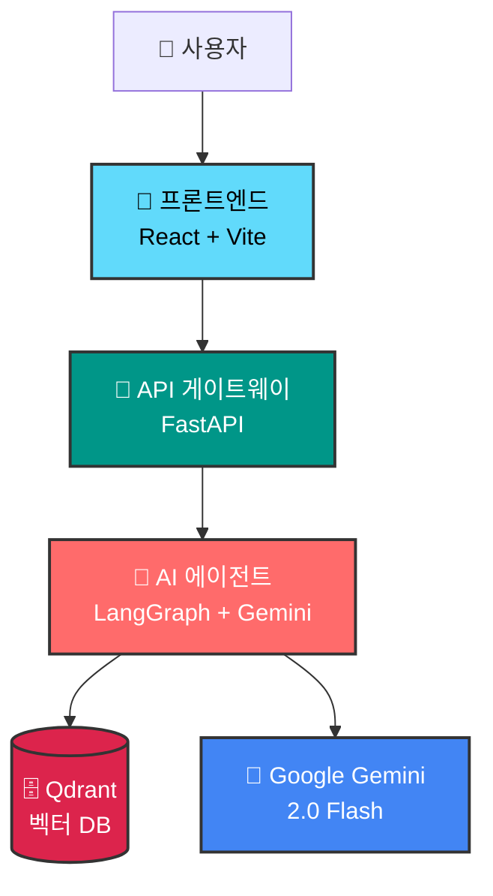
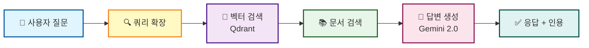
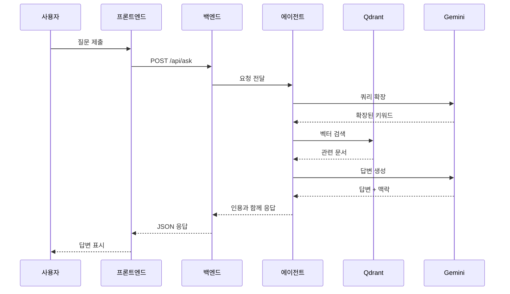

# InSeek - AI 기반 법령 문서 검색 시스템

<div align="center">


**대한민국 법령을 기반으로 정확한 답변을 제공하는 AI 서비스**

[English Documentation](README.md) | [데모](#-데모) | [아키텍처](#-아키텍처) | [빠른 시작](#-빠른-시작)

[](https://fastapi.tiangolo.com/)
[](https://reactjs.org/)
[](https://langchain-ai.github.io/langgraph/)
[](https://ai.google.dev/gemini-api)
[](https://qdrant.tech/)
[](LICENSE)

</div>

---

## 📖 목차

- [개요](#-개요)
- [해결하는 문제](#-해결하는-문제)
- [주요 기능](#-주요-기능)
- [데모](#-데모)
- [아키텍처](#-아키텍처)
- [기술 스택](#-기술-스택)
- [프로젝트 구조](#-프로젝트-구조)
- [빠른 시작](#-빠른-시작)
- [배포](#-배포)
- [성능](#-성능)
- [기여하기](#-기여하기)
- [라이선스](#-라이선스)

---

## 🎯 개요

**InSeek**는 대한민국 법령을 기반으로 법률 관련 질문에 정확한 답변을 제공하는 AI 문서 검색 시스템입니다. LangGraph, Gemini 2.0, Qdrant 벡터 데이터베이스 등 최신 AI 기술을 활용하여 정확한 법령 정보와 적절한 인용을 제공합니다.

### 왜 InSeek인가?

- **정확성 우선**: 대한민국 공식 법령 문서에서 직접 정보 검색
- **정확한 인용**: 모든 답변에 구체적인 법령 조항 참조 포함
- **AI 기반**: Google Gemini 2.0 Flash를 활용한 자연어 이해
- **벡터 검색**: Qdrant 기반 의미론적 검색으로 관련 문서 검색
- **사용자 친화적**: 실시간 응답 표시가 있는 깔끔한 React 인터페이스

---

## 🚀 해결하는 문제

공무원과 시민들은 종종 특정 법률 정보를 빠르게 찾는 데 어려움을 겪습니다. 기존의 키워드 기반 검색은 질문의 의도를 이해하지 못해 다음과 같은 문제가 발생합니다:

- ❌ 시간 소모적인 수동 문서 검토
- ❌ 관련 법령 조항 찾기 어려움
- ❌ 중요한 조항을 놓칠 위험
- ❌ 법령 해석을 위한 전문 지식 필요

**InSeek는 이를 다음과 같이 해결합니다:**

- ✅ 자연어 질문 이해
- ✅ 한국 법령 문서 전반에 걸친 의미론적 검색
- ✅ 법령 인용과 함께 정확한 답변 제공
- ✅ 모든 사람이 법률 정보에 쉽게 접근

**질문 예시:**
```
질문: "민원인이 초본 신청하는데 이름이랑 주소는 적혀있는데 주민등록번호가 없는경우에도 교부 가능한가?"

답변: "주민등록법 시행령 제47조 제2항에 따르면, 이름과 주소가 기재되어 있으면 주민등록번호 없이도 교부가 가능합니다."

인용: [주민등록법 시행령 제47조 제2항]
처리 시간: 약 2.3초
```

---

## ✨ 주요 기능

### 🤖 AI 에이전트 (LangGraph 워크플로우)

- **쿼리 확장**: 사용자 질문을 분석하고 더 나은 검색을 위해 키워드 확장
- **의미론적 검색**: 한국어 최적화 임베딩 사용 (jhgan/ko-sroberta-multitask)
- **맥락 인식 답변**: 검색된 문서를 기반으로 사용자 친화적인 응답 생성
- **법령 인용**: 특정 조항과 항을 자동으로 참조

### 🔍 지능형 검색

- **벡터 데이터베이스**: 빠른 의미론적 유사도 검색을 위한 Qdrant
- **한국어 최적화**: 한국 법률 용어에 특화된 임베딩
- **관련성 점수**: 유사도 임계값 필터링 (기본값: 0.7)
- **Top-K 검색**: 설정 가능한 결과 제한 (기본값: 5개 문서)

### 🎨 사용자 인터페이스

- **현대적인 React UI**: React 18 + Vite + Tailwind CSS로 구축
- **실시간 피드백**: 처리 중 원형 진행 표시기
- **반응형 디자인**: 데스크톱과 모바일에서 원활하게 작동
- **에러 처리**: 명확한 오류 메시지와 재시도 메커니즘

### 🏗️ 마이크로서비스 아키텍처

- **에이전트 서비스**: 독립적인 AI 추론 백엔드
- **API 게이트웨이**: FastAPI 기반 요청 라우팅 및 응답 처리
- **프론트엔드**: Nginx를 통해 제공되는 정적 React SPA
- **컨테이너화**: 쉬운 배포를 위한 Docker 지원

---

## 🎬 데모

### 스크린샷

<table>
  <tr>
    <td align="center">
      
      <br />
      <b>메인 검색 인터페이스</b>
    </td>
    <td align="center">
      
      <br />
      <b>인용과 함께 제공되는 답변</b>
    </td>
  </tr>
</table>

### 비디오 데모

🎥 [전체 데모 비디오 보기](docs/demo/inseek-demo.mp4)

---

## 🏛️ 아키텍처

### 시스템 아키텍처



### LangGraph 워크플로우



### 컴포넌트 상호작용



---

## 🛠️ 기술 스택

### 프론트엔드
- **프레임워크**: React 18 with Vite
- **스타일링**: Tailwind CSS
- **HTTP 클라이언트**: Fetch API
- **번들러**: Vite 6
- **프로덕션 서버**: Nginx

### 백엔드 (API 게이트웨이)
- **프레임워크**: FastAPI 0.115
- **비동기 HTTP**: httpx
- **검증**: Pydantic 2.10
- **CORS**: 전체 origin 지원
- **서버**: Uvicorn

### 에이전트 (AI 백엔드)
- **오케스트레이션**: LangGraph 0.2.55
- **LLM**: Google Gemini 2.0 Flash (Google AI API 사용)
- **임베딩**: jhgan/ko-sroberta-multitask (한국어 최적화)
- **벡터 DB**: Qdrant
- **프레임워크**: FastAPI 0.115

### DevOps
- **컨테이너화**: Docker + Docker Compose
- **클라우드 플랫폼**: Google Cloud Run
- **CI/CD**: GitHub Actions (계획됨)
- **모니터링**: Cloud Logging

---

## 📁 프로젝트 구조

```
InSeek/
├── 📄 README.md                 # 영문 문서
├── 📄 README.ko.md              # 이 파일 (한글)
├── 🐳 docker-compose.yml        # 전체 스택 오케스트레이션
├── 📄 .gitignore                # Git 무시 규칙
│
├── 🤖 agent/                    # AI 에이전트 서비스
│   ├── main.py                  # FastAPI 서버
│   ├── requirements.txt         # Python 의존성
│   ├── Dockerfile               # 에이전트 컨테이너
│   ├── config/                  # 설정 파일
│   ├── core/                    # 핵심 컴포넌트
│   │   ├── embeddings.py        # 임베딩 모델
│   │   └── vector_store.py      # Qdrant 클라이언트
│   ├── agents/                  # LangGraph 노드
│   │   ├── query_expansion.py   # 쿼리 확장 에이전트
│   │   ├── law_search.py        # 벡터 검색 에이전트
│   │   └── answer_generation.py # 답변 생성 에이전트
│   ├── models/                  # 데이터 모델
│   └── utils/                   # 유틸리티 함수
│
├── 🔌 backend/                  # API 게이트웨이
│   ├── main.py                  # FastAPI 게이트웨이
│   ├── requirements.txt         # 의존성
│   ├── Dockerfile               # 백엔드 컨테이너
│   └── .env.example             # 환경변수 템플릿
│
├── 🎨 frontend/                 # React UI
│   ├── src/
│   │   ├── App.jsx              # 메인 컴포넌트
│   │   ├── main.jsx             # 진입점
│   │   └── index.css            # Tailwind 스타일
│   ├── public/                  # 정적 에셋
│   ├── package.json             # Node 의존성
│   ├── vite.config.js           # Vite 설정
│   ├── Dockerfile               # 프론트엔드 컨테이너
│   └── nginx.conf               # Nginx 설정
│
└── 📚 docs/                     # 문서
    ├── architecture.md          # 아키텍처 상세
    ├── deployment.md            # 배포 가이드
    ├── local-setup.md           # 로컬 개발
    ├── diagrams/                # 아키텍처 다이어그램
    ├── screenshots/             # UI 스크린샷
    └── demo/                    # 데모 비디오
```

---

## 🚀 빠른 시작

### 사전 준비사항

- Docker & Docker Compose (권장)
- 또는: Python 3.9+, Node.js 18+, Qdrant
- Google AI API 키 ([여기서 발급](https://ai.google.dev/gemini-api/docs/api-key))

### 옵션 1: Docker Compose (권장)

```bash
# 1. 저장소 복제
git clone https://github.com/yourusername/InSeek.git
cd InSeek

# 2. 환경 변수 설정
cp agent/.env.example agent/.env
cp backend/.env.example backend/.env

# agent/.env 편집
# GOOGLE_API_KEY=your_api_key_here
# QDRANT_URL=http://qdrant:6333

# backend/.env 편집
# LLM_SERVER_URL=http://agent:8080/api/v1/ask

# 3. 모든 서비스 시작
docker-compose up --build

# 서비스 접속:
# - 프론트엔드: http://localhost:3000
# - 백엔드: http://localhost:8000
# - 에이전트: http://localhost:8080
# - Qdrant: http://localhost:6333
```

### 옵션 2: 수동 설정

자세한 지침은 [docs/local-setup.md](docs/local-setup.md)를 참조하세요.

#### 에이전트 서비스

```bash
cd agent

# 가상 환경 생성
python -m venv venv
source venv/bin/activate  # Windows: venv\Scripts\activate

# 의존성 설치
pip install -r requirements.txt

# 환경 변수 설정
cp .env.example .env
# .env에서 GOOGLE_API_KEY 설정

# 에이전트 서버 실행
python main.py
# 서버는 http://localhost:8080에서 실행됩니다
```

#### 백엔드 게이트웨이

```bash
cd backend

# 의존성 설치
pip install -r requirements.txt

# 환경 변수 설정
cp .env.example .env
# .env 편집: LLM_SERVER_URL=http://localhost:8080/api/v1/ask

# 백엔드 실행
uvicorn main:app --reload --port 8000
# 서버는 http://localhost:8000에서 실행됩니다
```

#### 프론트엔드

```bash
cd frontend

# 의존성 설치
npm install

# 환경 변수 설정
cp .env.example .env
# .env 편집: VITE_API_URL=http://localhost:8000

# 개발 서버 실행
npm run dev
# 앱은 http://localhost:5173에서 실행됩니다

# 또는 프로덕션 빌드
npm run build
npm run preview
```

### API 테스트

```bash
# 에이전트 서비스 직접 테스트
curl -X POST "http://localhost:8080/api/v1/ask" \
  -H "Content-Type: application/json" \
  -d '{
    "question": "초본 발급 시 주민등록번호가 필요한가요?"
  }'

# 백엔드 게이트웨이를 통한 테스트
curl -X POST "http://localhost:8000/api/ask" \
  -H "Content-Type: application/json" \
  -d '{
    "question": "초본 발급 시 주민등록번호가 필요한가요?"
  }'
```

---

## 🌐 배포

### Google Cloud Run 배포

#### 에이전트 서비스 배포

```bash
cd agent

# Docker 이미지 빌드 및 푸시
gcloud builds submit --tag gcr.io/[PROJECT_ID]/inseek-agent

# Cloud Run에 배포
gcloud run deploy inseek-agent \
  --image gcr.io/[PROJECT_ID]/inseek-agent \
  --platform managed \
  --region asia-northeast3 \
  --allow-unauthenticated \
  --set-env-vars GOOGLE_API_KEY=[YOUR_KEY] \
  --set-env-vars QDRANT_URL=[YOUR_QDRANT_URL]
```

#### 백엔드 게이트웨이 배포

```bash
cd backend

gcloud builds submit --tag gcr.io/[PROJECT_ID]/inseek-backend

gcloud run deploy inseek-backend \
  --image gcr.io/[PROJECT_ID]/inseek-backend \
  --platform managed \
  --region asia-northeast3 \
  --allow-unauthenticated \
  --set-env-vars LLM_SERVER_URL=[AGENT_SERVICE_URL]
```

#### 프론트엔드 배포

```bash
cd frontend

# 프로덕션 API URL로 빌드
docker build -t gcr.io/[PROJECT_ID]/inseek-frontend \
  --build-arg VITE_API_URL=[BACKEND_SERVICE_URL] .

docker push gcr.io/[PROJECT_ID]/inseek-frontend

gcloud run deploy inseek-frontend \
  --image gcr.io/[PROJECT_ID]/inseek-frontend \
  --platform managed \
  --region asia-northeast3 \
  --allow-unauthenticated \
  --port 8080
```

자세한 배포 지침은 [docs/deployment.md](docs/deployment.md)를 참조하세요.

---

## 📊 성능

### 지표

- **평균 응답 시간**: 2-3초
- **검색 정확도**: 0.7 임계값을 사용한 벡터 유사도
- **동시 요청**: 비동기 처리 지원
- **임베딩 모델**: jhgan/ko-sroberta-multitask (한국어 최적화)

### 최적화

- **캐싱**: 빈번한 쿼리를 위한 Qdrant 인메모리 캐싱
- **비동기 처리**: 전체 스택에서 논블로킹 I/O
- **경량 LLM**: 빠른 추론을 위한 Gemini 2.0 Flash
- **CDN**: Nginx/Cloud CDN을 통해 제공되는 정적 에셋

### 확장성

- **수평 확장**: 각 서비스가 독립적으로 확장
- **무상태 설계**: 세션 의존성 없음
- **클라우드 네이티브**: Cloud Run 자동 확장을 위해 설계됨

---

## 🤝 기여하기

기여를 환영합니다! 다음 단계를 따라주세요:

1. 저장소 포크
2. 기능 브랜치 생성 (`git checkout -b feature/AmazingFeature`)
3. 변경사항 커밋 (`git commit -m 'Add some AmazingFeature'`)
4. 브랜치에 푸시 (`git push origin feature/AmazingFeature`)
5. Pull Request 생성

### 개발 가이드라인

- Python 코드는 PEP 8을 따르세요
- JavaScript/React는 ESLint/Prettier 사용
- 의미 있는 커밋 메시지 작성
- 새로운 기능에 대한 테스트 추가
- 필요에 따라 문서 업데이트

---

## 📜 라이선스

이 프로젝트는 MIT 라이선스에 따라 라이선스가 부여됩니다 - 자세한 내용은 [LICENSE](LICENSE) 파일을 참조하세요.

---

## 🙏 감사의 말

- **Google Gemini API**: 강력한 LLM 기능 제공
- **LangChain/LangGraph**: AI 워크플로우 오케스트레이션
- **Qdrant**: 벡터 유사도 검색
- **대한민국 법령 데이터베이스**: 공식 법률 문서 소스

---

<div align="center">

**⭐ 이 저장소가 유용하다면 스타를 눌러주세요!**

@jharinn이 제작

[⬆ 맨 위로](#inseek---ai-기반-법령-문서-검색-시스템)

</div>
