# InSeek - AI-Powered Legal Document Search System

<div align="center">


**Accurate answers based on Korean legal statutes using AI**

[한국어 문서](README.ko.md) | [Demo](#-demo) | [Architecture](#-architecture) | [Quick Start](#-quick-start)

[](https://fastapi.tiangolo.com/)
[](https://reactjs.org/)
[](https://langchain-ai.github.io/langgraph/)
[](https://ai.google.dev/gemini-api)
[](https://qdrant.tech/)
[](LICENSE)

</div>

---

## 📖 Table of Contents

- [Overview](#-overview)
- [Problem Statement](#-problem-statement)
- [Key Features](#-key-features)
- [Demo](#-demo)
- [Architecture](#-architecture)
- [Tech Stack](#-tech-stack)
- [Project Structure](#-project-structure)
- [Quick Start](#-quick-start)
- [Deployment](#-deployment)
- [Performance](#-performance)
- [Contributing](#-contributing)
- [License](#-license)

---

## 🎯 Overview

**InSeek** is an AI-powered document search system that provides accurate answers to legal questions based on Korean legislation. Built with modern AI technologies including LangGraph, Gemini 2.0, and Qdrant vector database, InSeek delivers precise legal information with proper citations.

### Why InSeek?

- **Accuracy First**: Retrieves information directly from official Korean legal documents
- **Proper Citations**: Every answer includes specific legal article references
- **AI-Powered**: Uses Google Gemini 2.0 Flash for natural language understanding
- **Vector Search**: Qdrant-based semantic search for relevant document retrieval
- **User-Friendly**: Clean React interface with real-time response indicators

---

## 🚀 Problem Statement

Government officials and citizens often struggle to find specific legal information quickly. Traditional keyword-based search fails to understand the intent behind questions, resulting in:

- ❌ Time-consuming manual document review
- ❌ Difficulty finding relevant legal articles
- ❌ Risk of missing important provisions
- ❌ Need for legal expertise to interpret statutes

**InSeek solves this by:**

- ✅ Understanding natural language questions
- ✅ Semantic search across Korean legal documents
- ✅ Providing accurate answers with legal citations
- ✅ Making legal information accessible to everyone

**Example Query:**
```
Question: "민원인이 초본 신청하는데 이름이랑 주소는 적혀있는데 주민등록번호가 없는경우에도 교부 가능한가?"
(Can a certificate be issued if the application has name and address but no resident registration number?)

Answer: "주민등록법 시행령 제47조 제2항에 따르면, 이름과 주소가 기재되어 있으면 주민등록번호 없이도 교부가 가능합니다."
(According to Article 47, Paragraph 2 of the Enforcement Decree of the Resident Registration Act, 
issuance is possible without a resident registration number if name and address are provided.)

Citations: [주민등록법 시행령 제47조 제2항]
Processing Time: ~2.3s
```

---

## ✨ Key Features

### 🤖 AI Agent (LangGraph Workflow)

- **Query Expansion**: Analyzes user questions and expands keywords for better search
- **Semantic Search**: Uses Korean-optimized embeddings (jhgan/ko-sroberta-multitask)
- **Context-Aware Answers**: Generates human-friendly responses based on retrieved documents
- **Legal Citations**: Automatically references specific articles and clauses

### 🔍 Intelligent Search

- **Vector Database**: Qdrant for fast semantic similarity search
- **Korean Language Optimized**: Specialized embeddings for Korean legal terminology
- **Relevance Scoring**: Similarity threshold filtering (default: 0.7)
- **Top-K Retrieval**: Configurable result limits (default: 5 documents)

### 🎨 User Interface

- **Modern React UI**: Built with React 18 + Vite + Tailwind CSS
- **Real-time Feedback**: Circular progress indicator during processing
- **Responsive Design**: Works seamlessly on desktop and mobile
- **Error Handling**: Clear error messages and retry mechanisms

### 🏗️ Microservices Architecture

- **Agent Service**: Independent AI inference backend
- **API Gateway**: FastAPI-based request routing and response handling
- **Frontend**: Static React SPA served via Nginx
- **Containerized**: Docker-ready for easy deployment

---

## 🎬 Demo

### Screenshots

<table>
  <tr>
    <td align="center">
      
      <br />
      <b>Main Search Interface</b>
    </td>
    <td align="center">
      
      <br />
      <b>Answer with Citations</b>
    </td>
  </tr>
</table>

### Video Demo

🎥 [Watch Full Demo Video](docs/demo/inseek-demo.mp4)

---

## 🏛️ Architecture

### System Architecture

```mermaid
graph TB
    User[👤 User] --> Frontend[🎨 Frontend<br/>React + Vite]
    Frontend --> Backend[🔌 API Gateway<br/>FastAPI]
    Backend --> Agent[🤖 AI Agent<br/>LangGraph + Gemini]
    Agent --> Qdrant[(🗄️ Qdrant<br/>Vector DB)]
    Agent --> Gemini[🧠 Google Gemini<br/>2.0 Flash]
    
    style Frontend fill:#61DAFB,stroke:#333,stroke-width:2px,color:#000
    style Backend fill:#009688,stroke:#333,stroke-width:2px,color:#fff
    style Agent fill:#FF6B6B,stroke:#333,stroke-width:2px,color:#fff
    style Qdrant fill:#DC244C,stroke:#333,stroke-width:2px,color:#fff
    style Gemini fill:#4285F4,stroke:#333,stroke-width:2px,color:#fff
```



### LangGraph Workflow

```mermaid
graph LR
    A[📝 User Question] --> B[🔍 Query Expansion]
    B --> C[🔎 Vector Search<br/>Qdrant]
    C --> D[📚 Document Retrieval]
    D --> E[🤖 Answer Generation<br/>Gemini 2.0]
    E --> F[✅ Response + Citations]
    
    style A fill:#e1f5ff,stroke:#01579b,stroke-width:2px
    style B fill:#fff9c4,stroke:#f57f17,stroke-width:2px
    style C fill:#f3e5f5,stroke:#4a148c,stroke-width:2px
    style D fill:#e8f5e9,stroke:#1b5e20,stroke-width:2px
    style E fill:#fce4ec,stroke:#880e4f,stroke-width:2px
    style F fill:#e0f2f1,stroke:#004d40,stroke-width:2px
```



### Component Interaction


---

## 🛠️ Tech Stack

### Frontend
- **Framework**: React 18 with Vite
- **Styling**: Tailwind CSS
- **HTTP Client**: Fetch API
- **Bundler**: Vite 6
- **Production Server**: Nginx

### Backend (API Gateway)
- **Framework**: FastAPI 0.115
- **Async HTTP**: httpx
- **Validation**: Pydantic 2.10
- **CORS**: Full origin support
- **Server**: Uvicorn

### Agent (AI Backend)
- **Orchestration**: LangGraph 0.2.55
- **LLM**: Google Gemini 2.0 Flash (via Google AI API)
- **Embeddings**: jhgan/ko-sroberta-multitask (Korean-optimized)
- **Vector DB**: Qdrant
- **Framework**: FastAPI 0.115

### DevOps
- **Containerization**: Docker + Docker Compose
- **Cloud Platform**: Google Cloud Run
- **CI/CD**: GitHub Actions (planned)
- **Monitoring**: Cloud Logging

---

## 📁 Project Structure

```
InSeek/
├── 📄 README.md                 # This file (English)
├── 📄 README.ko.md              # Korean documentation
├── 🐳 docker-compose.yml        # Full-stack orchestration
├── 📄 .gitignore                # Git ignore rules
│
├── 🤖 agent/                    # AI Agent Service
│   ├── main.py                  # FastAPI server
│   ├── requirements.txt         # Python dependencies
│   ├── Dockerfile               # Agent container
│   ├── config/                  # Configuration files
│   ├── core/                    # Core components
│   │   ├── embeddings.py        # Embedding model
│   │   └── vector_store.py      # Qdrant client
│   ├── agents/                  # LangGraph nodes
│   │   ├── query_expansion.py   # Query expansion agent
│   │   ├── law_search.py        # Vector search agent
│   │   └── answer_generation.py # Answer generation agent
│   ├── models/                  # Data models
│   └── utils/                   # Utility functions
│
├── 🔌 backend/                  # API Gateway
│   ├── main.py                  # FastAPI gateway
│   ├── requirements.txt         # Dependencies
│   ├── Dockerfile               # Backend container
│   └── .env.example             # Environment template
│
├── 🎨 frontend/                 # React UI
│   ├── src/
│   │   ├── App.jsx              # Main component
│   │   ├── main.jsx             # Entry point
│   │   └── index.css            # Tailwind styles
│   ├── public/                  # Static assets
│   ├── package.json             # Node dependencies
│   ├── vite.config.js           # Vite configuration
│   ├── Dockerfile               # Frontend container
│   └── nginx.conf               # Nginx config
│
└── 📚 docs/                     # Documentation
    ├── architecture.md          # Architecture details
    ├── deployment.md            # Deployment guide
    ├── local-setup.md           # Local development
    ├── diagrams/                # Architecture diagrams
    ├── screenshots/             # UI screenshots
    └── demo/                    # Demo videos
```

---

## 🚀 Quick Start

### Prerequisites

- Docker & Docker Compose (recommended)
- OR: Python 3.9+, Node.js 18+, Qdrant
- Google AI API Key ([Get one here](https://ai.google.dev/gemini-api/docs/api-key))

### Option 1: Docker Compose (Recommended)

```bash
# 1. Clone the repository
git clone https://github.com/yourusername/InSeek.git
cd InSeek

# 2. Set up environment variables
cp agent/.env.example agent/.env
cp backend/.env.example backend/.env

# Edit agent/.env
# GOOGLE_API_KEY=your_api_key_here
# QDRANT_URL=http://qdrant:6333

# Edit backend/.env
# LLM_SERVER_URL=http://agent:8080/api/v1/ask

# 3. Start all services
docker-compose up --build

# Services will be available at:
# - Frontend: http://localhost:3000
# - Backend: http://localhost:8000
# - Agent: http://localhost:8080
# - Qdrant: http://localhost:6333
```

### Option 2: Manual Setup

See detailed instructions in [docs/local-setup.md](docs/local-setup.md)

#### Agent Service

```bash
cd agent

# Create virtual environment
python -m venv venv
source venv/bin/activate  # On Windows: venv\Scripts\activate

# Install dependencies
pip install -r requirements.txt

# Set environment variables
cp .env.example .env
# Edit .env with your GOOGLE_API_KEY

# Run agent server
python main.py
# Server runs at http://localhost:8080
```

#### Backend Gateway

```bash
cd backend

# Install dependencies
pip install -r requirements.txt

# Set environment variables
cp .env.example .env
# Edit .env: LLM_SERVER_URL=http://localhost:8080/api/v1/ask

# Run backend
uvicorn main:app --reload --port 8000
# Server runs at http://localhost:8000
```

#### Frontend

```bash
cd frontend

# Install dependencies
npm install

# Set environment variables
cp .env.example .env
# Edit .env: VITE_API_URL=http://localhost:8000

# Run development server
npm run dev
# App runs at http://localhost:5173

# Or build for production
npm run build
npm run preview
```

### Testing the API

```bash
# Test agent service directly
curl -X POST "http://localhost:8080/api/v1/ask" \
  -H "Content-Type: application/json" \
  -d '{
    "question": "초본 발급 시 주민등록번호가 필요한가요?"
  }'

# Test via backend gateway
curl -X POST "http://localhost:8000/api/ask" \
  -H "Content-Type: application/json" \
  -d '{
    "question": "초본 발급 시 주민등록번호가 필요한가요?"
  }'
```

---

## 🌐 Deployment

### Google Cloud Run Deployment

#### Deploy Agent Service

```bash
cd agent

# Build and push Docker image
gcloud builds submit --tag gcr.io/[PROJECT_ID]/inseek-agent

# Deploy to Cloud Run
gcloud run deploy inseek-agent \
  --image gcr.io/[PROJECT_ID]/inseek-agent \
  --platform managed \
  --region asia-northeast3 \
  --allow-unauthenticated \
  --set-env-vars GOOGLE_API_KEY=[YOUR_KEY] \
  --set-env-vars QDRANT_URL=[YOUR_QDRANT_URL]
```

#### Deploy Backend Gateway

```bash
cd backend

gcloud builds submit --tag gcr.io/[PROJECT_ID]/inseek-backend

gcloud run deploy inseek-backend \
  --image gcr.io/[PROJECT_ID]/inseek-backend \
  --platform managed \
  --region asia-northeast3 \
  --allow-unauthenticated \
  --set-env-vars LLM_SERVER_URL=[AGENT_SERVICE_URL]
```

#### Deploy Frontend

```bash
cd frontend

# Build with production API URL
docker build -t gcr.io/[PROJECT_ID]/inseek-frontend \
  --build-arg VITE_API_URL=[BACKEND_SERVICE_URL] .

docker push gcr.io/[PROJECT_ID]/inseek-frontend

gcloud run deploy inseek-frontend \
  --image gcr.io/[PROJECT_ID]/inseek-frontend \
  --platform managed \
  --region asia-northeast3 \
  --allow-unauthenticated \
  --port 8080
```

For detailed deployment instructions, see [docs/deployment.md](docs/deployment.md)

---

## 📊 Performance

### Metrics

- **Average Response Time**: 2-3 seconds
- **Search Accuracy**: Vector similarity with 0.7 threshold
- **Concurrent Requests**: Supports async processing
- **Embedding Model**: jhgan/ko-sroberta-multitask (Korean-optimized)

### Optimization

- **Caching**: Qdrant in-memory caching for frequent queries
- **Async Processing**: Non-blocking I/O throughout the stack
- **Lightweight LLM**: Gemini 2.0 Flash for fast inference
- **CDN**: Static assets served via Nginx/Cloud CDN

### Scalability

- **Horizontal Scaling**: Each service scales independently
- **Stateless Design**: No session dependencies
- **Cloud-Native**: Designed for Cloud Run autoscaling

---

## 🤝 Contributing

We welcome contributions! Please follow these steps:

1. Fork the repository
2. Create a feature branch (`git checkout -b feature/AmazingFeature`)
3. Commit your changes (`git commit -m 'Add some AmazingFeature'`)
4. Push to the branch (`git push origin feature/AmazingFeature`)
5. Open a Pull Request

### Development Guidelines

- Follow PEP 8 for Python code
- Use ESLint/Prettier for JavaScript/React
- Write meaningful commit messages
- Add tests for new features
- Update documentation as needed

---

## 📜 License

This project is licensed under the MIT License - see the [LICENSE](LICENSE) file for details.

---

## 🙏 Acknowledgments

- **Google Gemini API**: For powerful LLM capabilities
- **LangChain/LangGraph**: For AI workflow orchestration
- **Qdrant**: For vector similarity search
- **Korean Legal Database**: For official legal document sources

---

<div align="center">

**⭐ Star this repo if you find it useful!**

Made by [@jharinn]

[⬆ Back to Top](#inseek---ai-powered-legal-document-search-system)

</div>
